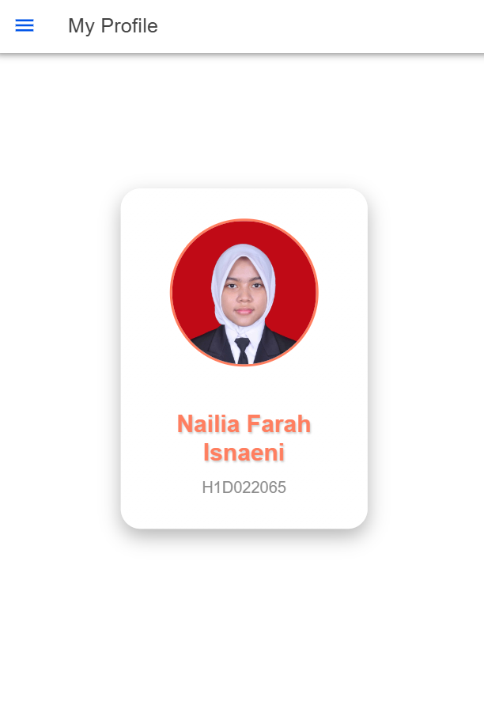

Pada file TypeScript (folder.page.ts), deklarasikan variabel photoURL yang akan menyimpan URL foto. Pada constructor, tentukan nilai photoURL yang mengarah ke lokasi foto dalam folder assets/img, seperti this.photoURL = 'assets/img/far.jpg';. Ini memungkinkan aplikasi untuk mengakses gambar yang diinginkan.

Pada file HTML (folder.page.html) dan tambahkan struktur HTML yang sesuai. Di dalam <ion-content>, buat div dengan ID container yang berfungsi sebagai wadah untuk foto, nama, dan NIM. Gunakan tag  dengan binding Angular untuk menghubungkan atribut src dengan variabel photoURL, sehingga foto dapat ditampilkan dengan benar. Di bawah foto, tambahkan tag <h1> untuk menampilkan nama, dan tag 
 untuk NIM.

Kemudian, dalam file CSS (folder.page.scss), tambahkan styling untuk kontainer, foto, nama, dan NIM. Misalnya, buat kelas .photo-container untuk mengatur ukuran dan gaya foto profil, serta .name dan .nim untuk memberikan tampilan yang menarik pada teks. Pastikan juga menggunakan latar belakang yang sesuai agar tampilan lebih menarik.
